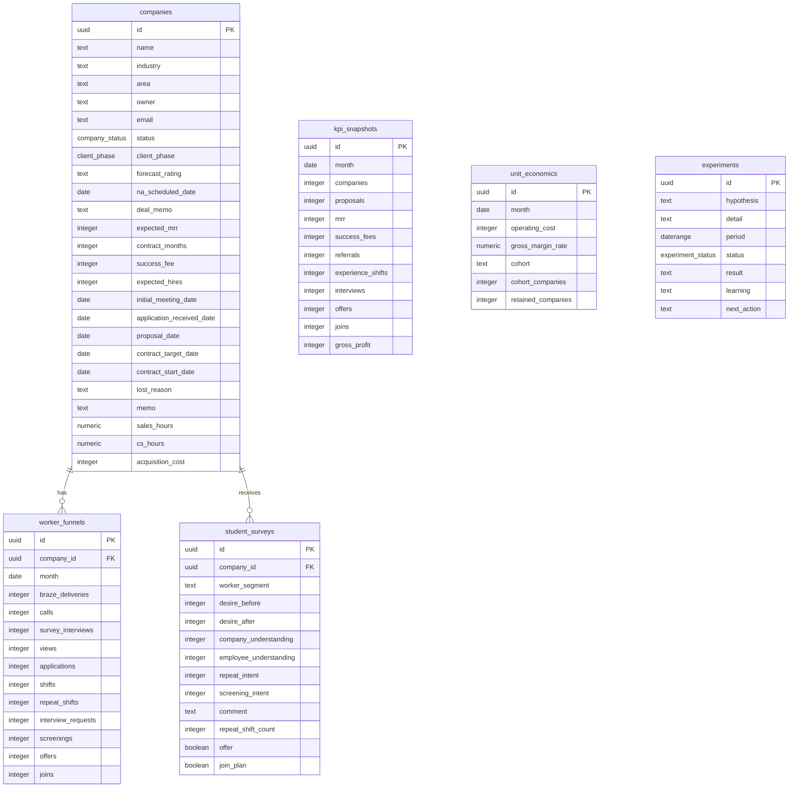

# 新卒採用事業 Dashboard

「タイミー上の働く体験」を起点にした新卒採用事業の成立性を検証するWebダッシュボードです。案件管理だけでなく、どの業界に刺さるか、学生の行動変容が起きるか、MRR/成功報酬/工数を含めて採算が合うかを一画面群で追えるようにしています。

## Stack

- Next.js App Router
- TypeScript
- Tailwind CSS
- Recharts
- Supabase / PostgreSQL想定

## Run

```bash
npm install
npm run dev
```

Open `http://localhost:3000`.

## Password Protection

外部ユーザーに共有する場合はBasic認証を有効にします。

```bash
cp .env.example .env.local
```

`.env.local` の値を変更してください。

```bash
DASHBOARD_USER=admin
DASHBOARD_PASSWORD=your-secure-password
```

`DASHBOARD_USER` と `DASHBOARD_PASSWORD` が設定されている環境では、全ページにパスワードがかかります。Vercelなどにデプロイする場合も同じ環境変数を設定してください。

## Pages

- Executive Dashboard: 導入社数、提案社数、商談化率、受注率、提案→受注CVR、MRR、成功報酬、送客、体験、面談、内定、入社、粗利、10社目標進捗
- FCST: 案件入力、テーブル/カンバン切替、企業詳細モーダル、企業データ編集/削除、契約期間/ARR見込み、ARR見込み案件数、MRR自動合計、提案→受注CVR、失注理由分析
- Client: 登録済みクライアントの商談フェーズ管理。FCSTステータスとは別に、P0アポ予定からP7申込書回収までをカンバン/一覧で管理。Pipeline作成、NA予定日、商談メモの入力/編集に対応
- Worker Funnel: 流入元入力/可視化、ファネル入力/編集/削除、閲覧から入社までのファネル、日時別のファネル推移、企業別/業界別比較、前月比較
- Hiring Analytics: 内定率、入社率、企業別成果、業界別成果、属性別成果
- Unit Economics: CAC、営業/CS工数、1内定あたり工数、月間運用コストの入力/編集、粗利率、LTV/CAC、回収期間、コホート

## Component Structure

- `app/page.tsx`: 画面ルーティング、各ビュー、モーダル
- `components/ui.tsx`: カード、メトリクス、ピル、プログレスなどの基本UI
- `components/charts.tsx`: Rechartsベースのグラフ群
- `lib/data.ts`: 初期表示用ダミーデータ
- `lib/kpis.ts`: KPI計算ロジック
- `lib/types.ts`: ドメイン型
- `supabase/schema.sql`: Supabase/PostgreSQLテーブル定義
- `supabase/seed.sql`: 初期ダミーデータ
- `supabase/worker-source-funnel-migration.sql`: Workerの流入元別ファネル追加カラム
- `supabase/forecast-rating-migration.sql`: Clientの受注ヨミ追加カラム

## KPI Logic

- 商談化率 = リード以外の企業数 / 全企業数
- 受注率 = 受注企業数 / 提案済み企業数
- 提案→受注CVR = 受注企業数 / 提案済み企業数
- 受注リードタイム = `申込書回収日 - 初回商談日` の受注企業平均
- MRR合計 = `P7 申込書回収` かつ申込回収予定日・契約開始日が未来ではない企業の `expectedMrr` 合計
- ARPU = `MRR反映対象企業のMRR合計 / MRR反映対象企業数`
- ARR見込み = MRR反映対象企業ごとの `想定MRR × 契約期間（月）`
- ARR見込み案件数 = `ARR見込みが1円以上かつMRR反映対象の案件数`
- 成功報酬累計 = 入社予定者数 × 400,000円
- 再勤務率 = リピート勤務数 / タイミー勤務数
- 面談化率 = 面談希望数 / タイミー勤務数
- 内定率 = 内定数 / 選考参加数
- 入社率 = 入社予定者数 / 内定数
- 1社あたり粗利 = `(MRR + 成功報酬 - 月間運用コスト) / 受注企業数`
- LTV = 平均MRR × 12ヶ月 × 粗利率 + 平均成功報酬 × 粗利率
- LTV/CAC = LTV / CAC
- 回収期間 = CAC / 月次粗利

## ER Diagram



## DB Setup

Supabase SQL editorで以下を順に実行します。

```sql
-- 1. schema
-- supabase/schema.sql

-- 2. seed
-- supabase/seed.sql
```

Supabaseに保存する場合は、VercelのProject Settings → Environment Variablesに以下を追加します。

```bash
NEXT_PUBLIC_SUPABASE_URL=https://xxxxx.supabase.co
NEXT_PUBLIC_SUPABASE_ANON_KEY=xxxxx
```

この2つが設定されている場合、アプリはSupabaseから読み込み、FCST・Worker Funnel・Unit Economics・Surveyの入力/編集/削除をDBへ保存します。未設定の場合は、開発用としてこれまで通りブラウザ内の `localStorage` に保存されます。

既存DBにあとから反映する場合は、`worker_funnels` に以下のカラムを追加してください。

```sql
alter table worker_funnels
add column if not exists previous_month_applications integer not null default 0;
```

Clientページを追加する既存DBでは、以下をSupabase SQL editorで実行してください。

```sql
-- supabase/client-phase-migration.sql
```

受注ヨミを追加する既存DBでは、以下をSupabase SQL editorで実行してください。過去に古いCHECK制約が入っている場合も、このSQLで現在の仕様（`★★★` / `★★` / `★` / `-`）に揃えます。

```sql
-- supabase/forecast-rating-migration.sql
```

## Data Entry

入力専用ページではなく、数字を見るページの中でそのまま入力できます。初期ダミーデータは各カテゴリ1件だけ残しています。

- FCSTページ: 企業、営業ステータス、業界、所在地エリア、契約期間、ARR見込み、MRR、成功報酬、採用人数、初回商談日、申込書回収日、契約日、失注理由、工数
- Clientページ: Pipeline作成、登録済み企業ごとの商談フェーズ（P0 アポ予定、P1 案件の見極め、P2 課題の特定、P3 推進者との導入合意、P4 決裁者との導入合意、P5 価格・導入時期の合意、P6 稟議決裁、P7 申込書回収）、NA予定日、商談メモ
- Workerページ: 企業、記録日、Braze配信、架電、アンケート/IV、閲覧、応募、勤務、リピート勤務、面談希望、選考参加、内定、入社
- Unit Economicsページ: 対象月、月間運用コスト

Supabase環境変数を設定している本番環境では、入力データはSupabaseに保存され、各ダッシュボードへ即時反映されます。

各ページ下部にある「登録済み」リストから、企業、ファネルを1件ずつ削除できます。ファネルは企業×記録日で履歴管理でき、編集ボタンから過去レコードを更新できます。企業を削除すると、その企業に紐づくファネルも一緒に削除されます。
